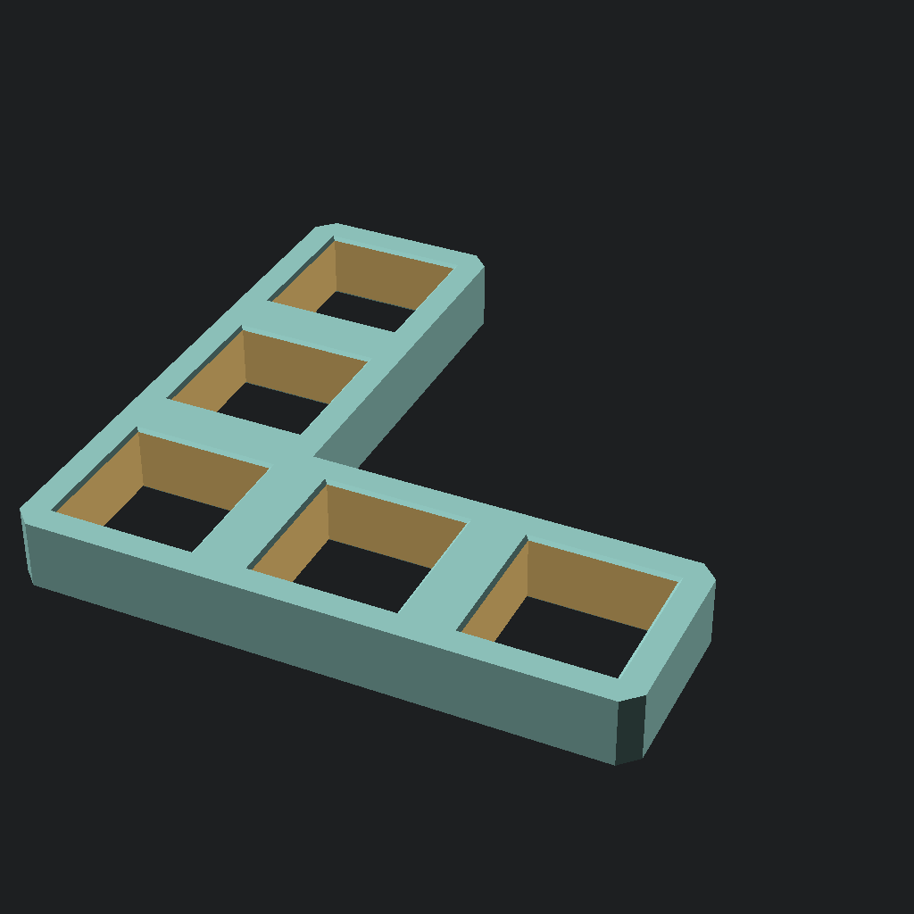
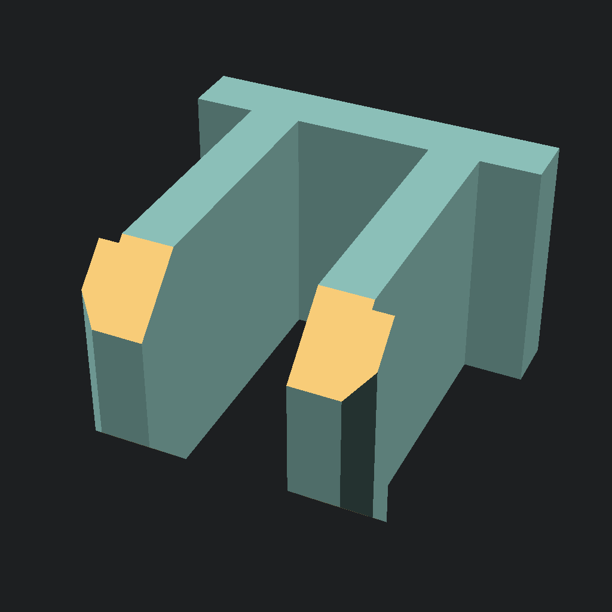
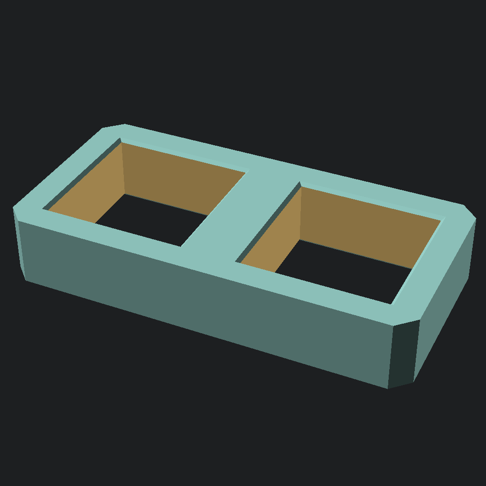

# Construction set

Simple construction set optimizied 3d printing written in OpenSCAD. This project demonstrates use of:

- [BOSL2](https://github.com/revarbat/BOSL2) library that helps write more intetion based code in OpenSCAD
- GitHub actions for building stl, gcode files and rendering previews on push and merge

|  |  |  |
| --- | --- | --- |

## Usage


```sh
build_gcodes.sh                 # generates gcodes of all pieces for 3d printing
render_previews.sh              # renders previews of all pieces

make output/<piece name>.stl    # generates stl file for single piece
make output/<piece name>.gcode  # generates gcode file for single piece
make output/<piece name>.png    # renders preview for single piece
```